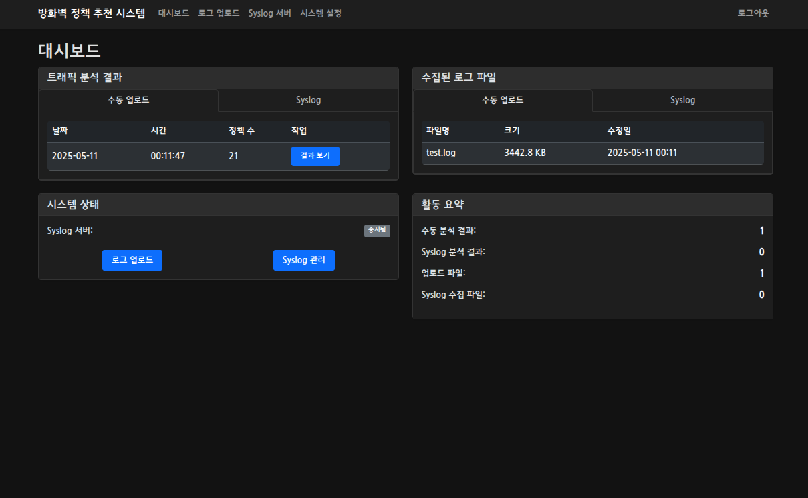
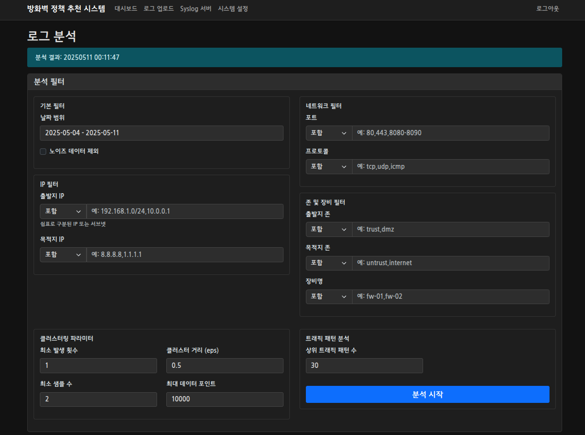
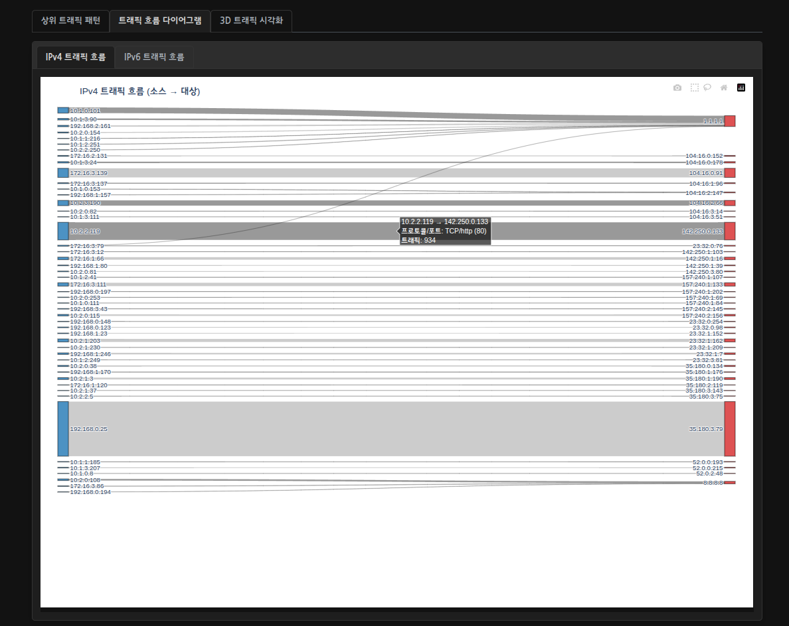
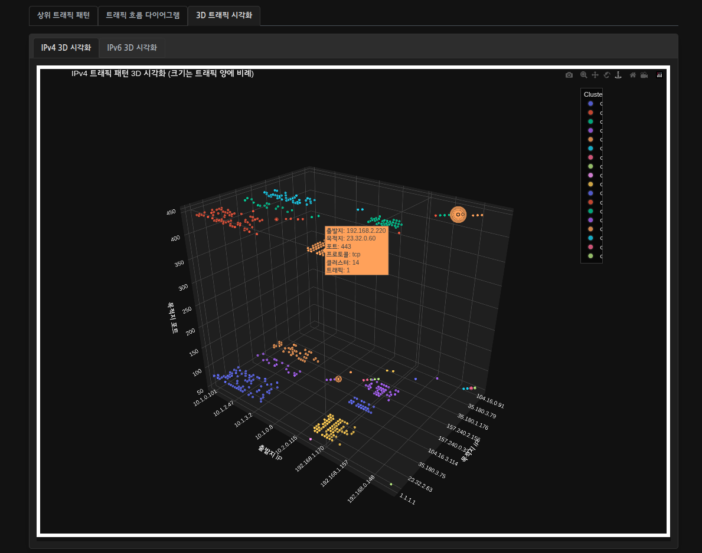
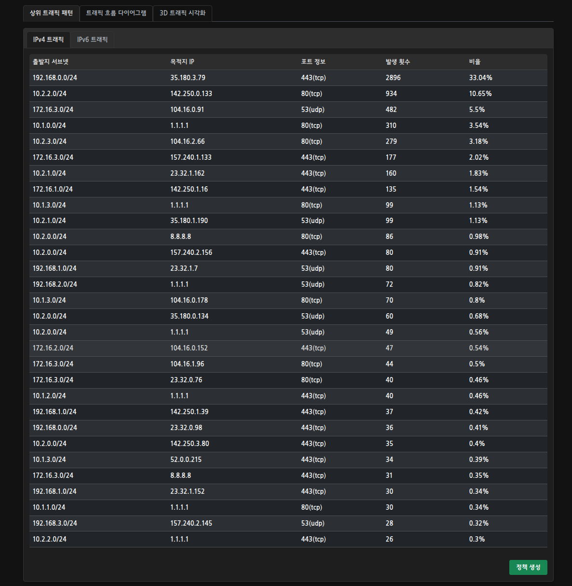
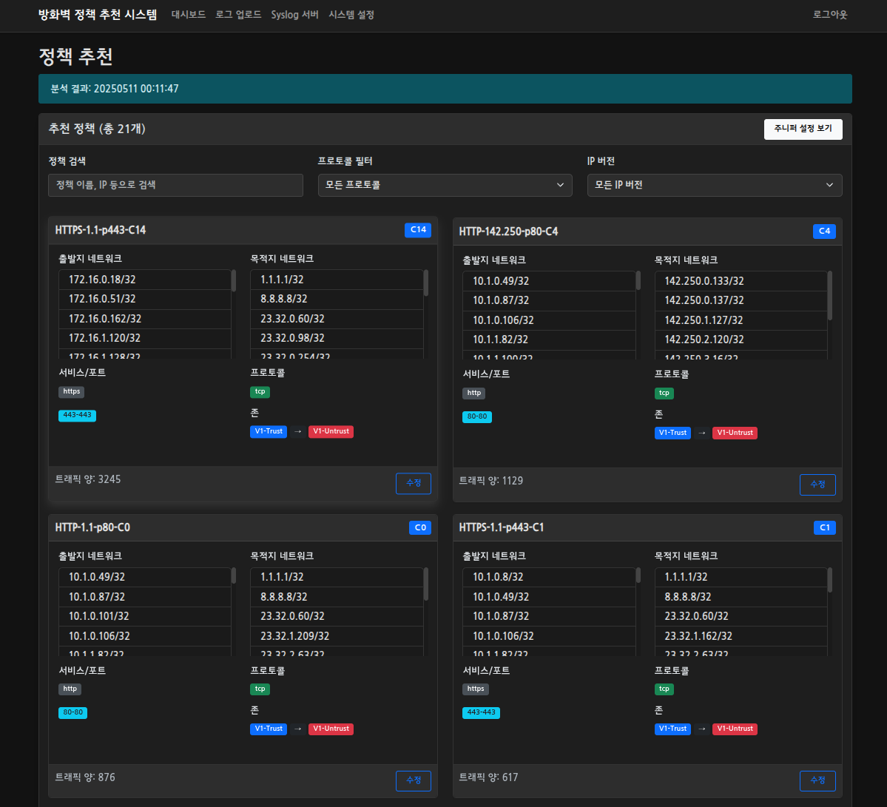

# 방화벽 정책 추천 시스템

방화벽 로그를 분석하여 트래픽 패턴을 식별하고 최적화된 보안 정책을 자동으로 추천하는 웹 기반 시스템입니다.



## 주요 기능

### 🔍 로그 분석
- 주니퍼 방화벽 syslog 형식 로그 파싱
- IPv4/IPv6 트래픽 분석 지원
- DBSCAN 알고리즘을 이용한 트래픽 패턴 클러스터링
- 실시간 Syslog 서버를 통한 로그 수집


### 📊 시각화
- Sankey 다이어그램을 통한 트래픽 흐름 시각화  

- 3D 인터랙티브 트래픽 패턴 시각화

- 상위 트래픽 패턴 분석 대시보드


### 🛡️ 정책 생성
- 클러스터링 결과 기반 자동 정책 추천
- 출발지/목적지 네트워크 최적화
- 포트 범위 자동 그룹화
- 주니퍼 방화벽 설정 자동 생성


### 🌐 웹 인터페이스
- 반응형 다크 모드 UI
- 실시간 분석 상태 표시
- 다중 필터링 옵션
- 설정 다운로드 및 클립보드 복사

## 시스템 요구사항

- Python 3.8+
- 4GB RAM 이상 (대용량 로그 분석 시 8GB 권장)
- 1GB 이상의 디스크 공간

## 빠른 시작

```bash
# 저장소 클론
git clone https://github.com/your-username/firewall-policy-recommender.git
cd firewall-policy-recommender

# 가상환경 생성 및 활성화
python -m venv venv
source venv/bin/activate  # Windows: venv\Scripts\activate

# 의존성 설치
pip install -r requirements.txt

# 서버 실행
python app.py
```

기본 설정으로 https://localhost:14000 에서 서비스에 접속할 수 있습니다.

## 기본 인증 정보

- 사용자명: `admin`
- 비밀번호: `admin`

> ⚠️ 프로덕션 환경에서는 반드시 비밀번호를 변경하세요!

## 프로젝트 구조

```
firewall-policy-recommender/
├── app.py                  # 메인 Flask 애플리케이션
├── modules/               # 핵심 모듈
│   ├── auth.py           # 인증 모듈
│   ├── log_parser.py     # 로그 파싱 모듈
│   ├── traffic_analyzer.py # 트래픽 분석 모듈
│   ├── policy_generator.py # 정책 생성 모듈
│   └── syslog_server.py  # Syslog 서버
├── templates/            # HTML 템플릿
├── static/              # 정적 파일
├── config/              # 설정 파일
│   ├── config.py       # 기본 설정
│   └── users.json      # 사용자 정보
├── logs/               # 수집된 로그 파일
├── output/             # 분석 결과 및 시각화
└── ssl/                # SSL 인증서 (선택사항)
```

## 설정

### SSL/TLS 설정

HTTPS를 사용하려면 SSL 인증서와 키 파일을 준비하세요:

```bash
# 자체 서명 인증서 생성 (개발용)
openssl req -x509 -newkey rsa:4096 -keyout ssl/key.pem -out ssl/cert.pem -days 365 -nodes
```

### Syslog 서버 설정

1. 웹 인터페이스에서 Syslog 메뉴 접속
2. 수신 주소와 포트 설정 (기본: 0.0.0.0:514)
3. 자동 분석 주기 설정 (기본: 3600초)
4. 서버 시작

### 방화벽 설정 예시 (주니퍼)

```
set system syslog host <서버_IP>
set system syslog host transport udp
set system syslog host port 514
set system syslog host any any
set system syslog host structured-data
```

## 고급 기능

### 필터링 옵션
- IP 주소/서브넷 필터
- 포트 번호 필터
- 프로토콜 필터
- 존(Zone) 필터
- 날짜 범위 필터

### DBSCAN 파라미터 조정
- `min_occurrences`: 최소 발생 횟수
- `eps`: 클러스터 거리 파라미터
- `min_samples`: 클러스터 형성 최소 샘플 수
- `max_data_points`: 최대 데이터 포인트 수

## API 참조

### POST /api/analyze
로그 분석 실행

### POST /syslog
Syslog 서버 제어 (start/stop)

### GET /api/system_info
시스템 상태 정보 조회

## 문제 해결

### 메모리 부족 오류
대용량 로그 분석 시 `max_data_points` 값을 줄이거나 시스템 메모리를 늘리세요.

### Syslog 수신 실패
- 방화벽에서 UDP 514 포트가 열려있는지 확인
- SELinux/AppArmor 설정 확인
- 네트워크 라우팅 확인

## 라이선스

이 프로젝트는 MIT 라이선스 하에 배포됩니다.

## 기여하기

1. 이 저장소를 포크합니다
2. 새 기능 브랜치를 생성합니다 (`git checkout -b feature/amazing-feature`)
3. 변경사항을 커밋합니다 (`git commit -m 'Add amazing feature'`)
4. 브랜치에 푸시합니다 (`git push origin feature/amazing-feature`)
5. Pull Request를 생성합니다

## 문의

프로젝트 관련 문의나 버그 리포트는 이슈 트래커를 사용해주세요.
